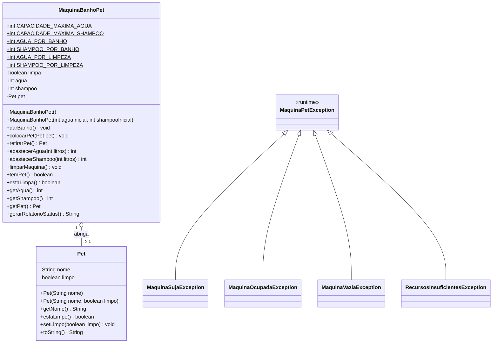

# 🐾 Simulador de Máquina de Banho em Pets (Pet Machine)

[](https://www.oracle.com/java/)
[](https://maven.apache.org/)
[](https://junit.org/junit5/)
[](https://pt.wikipedia.org/wiki/Programa%C3%A7%C3%A3o_orientada_a_objetos)
[](LICENSE)

> **Projeto prático desenvolvido para consolidar os pilares da Programação Orientada a Objetos (POO), com ênfase em Criação de Classes, Encapsulamento Estrito, Modelagem Rica de Domínio, Exceções Customizadas e Testes Unitários em Java 21.**

---

## 📌 Sumário
- [Visão Geral](#-visão-geral)
- [Diagrama de Classes (Mermaid)](#-diagrama-de-classes)
- [Pilares de POO & Engenharia de Software](#-pilares-de-poo--engenharia-de-software)
- [Regras de Negócio e Estados da Máquina](#-regras-de-negócio-e-estados-da-máquina)
- [Estrutura do Projeto](#-estrutura-do-projeto)
- [Testes Automatizados (JUnit 5)](#-testes-automatizados-junit-5)
- [Como Executar](#-como-executar)
- [Guia para Entrevistas Técnicas](#-guia-para-entrevistas-técnicas-java)
- [Autor](#-autor)

---

## 📖 Visão Geral

O projeto simula uma **máquina automatizada de dar banho em cachorros/pets**, inspirada nos desafios da trilha Java da **DIO (Digital Innovation One)** com foco em **Criação de Classes e Encapsulamento**.

Toda a arquitetura foi estruturada em **Português**, tornando o entendimento do domínio direto e claro, aplicando práticas recomendadas de mercado:
1. **Encapsulamento Rígido:** Variáveis como `agua`, `shampoo`, `limpa` e `pet` são estritamente privadas (`private`).
2. **Modelo Não-Anêmico (*Rich Domain Model*):** A classe `MaquinaBanhoPet` detém as regras de negócio e validações, garantindo que o objeto nunca entre em estado inválido.
3. **Exceções de Domínio Expressivas:** Hierarquia semântica de exceções (`MaquinaPetException`, `MaquinaSujaException`, `RecursosInsuficientesException`, etc.) no lugar de retornos mágicos ou impressões no console.
4. **Qualidade Assegurada por Testes:** 17 testes unitários com **JUnit 5** cobrindo fluxos de sucesso e casos de borda (*edge cases*).

---

## 📊 Diagrama de Classes



---

## 🏛️ Pilares de POO & Engenharia de Software

### 1. Encapsulamento
- Todos os atributos da máquina são privados.
- O abastecimento é controlado matematicamente (`Math.min`), não permitindo que a água ultrapasse os **30 litros** ou que o shampoo ultrapasse os **10 litros**, e bloqueando números negativos.
- Não existem *setters* abertos para os recursos. O estado muda exclusivamente via métodos com semântica de negócio: `darBanho()`, `abastecerAgua()`, `limparMaquina()`.

### 2. Princípio Fail-Fast com Exceções Especializadas
- `MaquinaSujaException`: Bloqueia a inserção de um novo animal caso a máquina ainda não tenha sido limpa após o banho anterior (previne contaminação cruzada).
- `MaquinaOcupadaException`: Impede colocar um pet quando a máquina já está ocupada ou tentar higienizar a máquina com o pet dentro.
- `MaquinaVaziaException`: Bloqueia o início do banho ou a tentativa de retirada se não houver animal na máquina.
- `RecursosInsuficientesException`: Valida se há insumos suficientes antes de iniciar qualquer operação.

### 3. Separação de Responsabilidades (SRP)
- **`Pet`**: Representa apenas a entidade do animal e seu estado de higiene.
- **`MaquinaBanhoPet`**: Gerencia todo o ciclo operacional, estoques e travas de segurança.
- **`Principal`**: Classe executável responsável pelo menu interativo de terminal (`Scanner`) e tratamento amigável de exceções.

---

## ⚙️ Regras de Negócio e Estados da Máquina

| Ação | Pré-requisitos | Consumo de Insumos | Mudança de Estado |
| :--- | :--- | :--- | :--- |
| **Colocar Pet (`colocarPet`)** | Máquina vazia (`pet == null`) E higienizada (`limpa == true`) | Nenhum | Pet é acomodado na máquina |
| **Dar Banho (`darBanho`)** | Conter pet + Água $\ge 10\text{L}$ + Shampoo $\ge 2\text{L}$ | $-10\text{L}$ de Água<br>$-2\text{L}$ de Shampoo | Pet fica limpo (`limpo = true`); Máquina fica suja (`limpa = false`) |
| **Retirar Pet (`retirarPet`)** | Conter pet (`pet != null`) | Nenhum | Animal é retirado e desvinculado da máquina |
| **Abastecer Água (`abastecerAgua`)** | Litros $> 0$ | $+N\text{L}$ (limite em $30\text{L}$) | Eleva o nível de água sem transbordar |
| **Abastecer Shampoo (`abastecerShampoo`)** | Litros $> 0$ | $+N\text{L}$ (limite em $10\text{L}$) | Eleva o nível de shampoo sem transbordar |
| **Higienizar Máquina (`limparMaquina`)** | Máquina sem pet + Água $\ge 3\text{L}$ + Shampoo $\ge 1\text{L}$ | $-3\text{L}$ de Água<br>$-1\text{L}$ de Shampoo | Máquina volta a ficar higienizada (`limpa = true`) |

---

## 📂 Estrutura do Projeto

```text
pet-machine-simulator/
├── pom.xml                                      # Configuração Maven e dependências (Java 21, JUnit 5)
├── README.md                                    # Documentação técnica e guia arquitetural
├── .gitignore                                   # Filtro de arquivos para Git
└── src/
    ├── main/
    │   └── java/
    │       └── com/dio/maquinapet/
    │           ├── Principal.java               # Classe executável (Menu interativo via Scanner)
    │           ├── modelo/
    │           │   └── Pet.java                 # Entidade de domínio Pet
    │           ├── maquina/
    │           │   └── MaquinaBanhoPet.java     # Encapsulamento central e regras de negócio
    │           └── excecao/                     # Hierarquia de exceções de domínio
    │               ├── MaquinaPetException.java
    │               ├── MaquinaSujaException.java
    │               ├── MaquinaOcupadaException.java
    │               ├── MaquinaVaziaException.java
    │               └── RecursosInsuficientesException.java
    └── test/
        └── java/
            └── com/dio/maquinapet/
                └── maquina/
                    └── MaquinaBanhoPetTest.java # 17 Testes unitários com JUnit 5
```

---

## 🧪 Testes Automatizados (JUnit 5)

O projeto possui **17 testes unitários** organizados em blocos aninhados (`@Nested`) cobrindo 100% das regras e casos de borda:

```text
[INFO] Running com.dio.maquinapet.maquina.MaquinaBanhoPetTest
[INFO] Tests run: 3, Failures: 0, Errors: 0 -- TestesHigienizacao
[INFO] Tests run: 4, Failures: 0, Errors: 0 -- TestesExecucaoBanho
[INFO] Tests run: 6, Failures: 0, Errors: 0 -- TestesEntradaSaidaPet
[INFO] Tests run: 4, Failures: 0, Errors: 0 -- TestesAbastecimento
[INFO] 
[INFO] Results:
[INFO] Tests run: 17, Failures: 0, Errors: 0, Skipped: 0
[INFO] BUILD SUCCESS
```

Para rodar os testes:
```bash
mvn test
```

---

## 🚀 Como Executar

### Pré-requisitos
- **Java JDK 21+** instalado
- **Apache Maven 3.9+** instalado (ou execute via `javac`)

### Execução via Maven (Recomendado)
Na pasta raiz do projeto:
```bash
mvn clean compile exec:java
```

### Execução Direta via Java Puro
```bash
# Compilar todas as classes
javac -d bin -sourcepath src/main/java src/main/java/com/dio/maquinapet/Principal.java

# Executar a aplicação
java -cp bin com.dio.maquinapet.Principal
```

---

## 💼 Guia para Entrevistas Técnicas (Java)

Respostas para perguntas frequentes de recrutadores e líderes técnicos sobre este projeto:

### 1. "O que é encapsulamento e como você o aplicou?"
> *"Encapsulamento é a prática de esconder os detalhes internos de implementação e o estado de um objeto, expondo apenas operações seguras. No projeto da Máquina de Banho Pet, todas as variáveis de estado (`agua`, `shampoo`, `limpa`, `pet`) são estritamente privadas. Um usuário da classe não pode alterar a água diretamente para um número negativo ou acima de 30L; ele precisa chamar o método `abastecerAgua()`, que valida a entrada e calcula o espaço restante de forma controlada."*

### 2. "Por que você criou exceções customizadas em vez de retornar boolean ou códigos de erro?"
> *"Utilizar exceções customizadas segue o princípio Fail-Fast. Quando uma regra de negócio é violada (ex: tentar colocar um pet na máquina suja com `MaquinaSujaException`), o fluxo é interrompido no momento exato da violação com uma mensagem semântica clara. Isso evita que o erro se propague silenciosamente e desacopla a regra de negócio da interface de usuário (console/CLI)."*

### 3. "Como você garantiu a qualidade do código entregue?"
> *"Construí uma suíte de 17 testes unitários com JUnit 5 cobrindo os caminhos felizes e os casos extremos (edge cases), como esgotamento de insumos, abastecimento além da capacidade máxima e bloqueio de contaminação cruzada entre animais."*

---

## 👨‍💻 Autor

Desenvolvido por **Rudson Lima**  
Desenvolvedor Backend Java & Inteligência Artificial.

[](https://www.linkedin.com/in/rudsonamerico/)
[](https://github.com/rngolima)

---
*Projeto educacional baseado nas trilhas da Digital Innovation One (DIO) em parceria com Itaú & Santander.*
