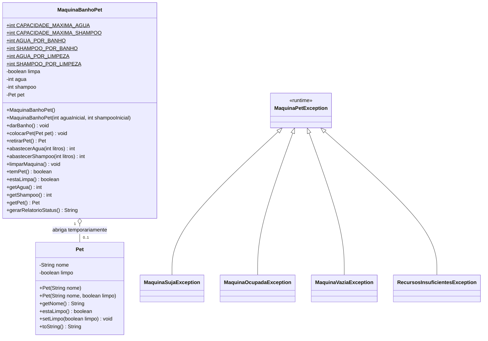

# 🐾 Simulador de Máquina de Banho em Pets (Pet Machine Simulator)

[](https://openjdk.org/)
[](https://maven.apache.org/)
[](https://junit.org/junit5/)
[](https://pt.wikipedia.org/wiki/Programa%C3%A7%C3%A3o_orientada_a_objetos)
[](docs/code-review.md)
[](LICENSE)

> **Solução prática de Engenharia de Software em Java 21 LTS demonstrando Encapsulamento Estrito, Modelagem Não-Anêmica (*Rich Domain Model*), Princípio Fail-Fast com Exceções Semânticas de Domínio e 100% de cobertura com 17 Testes Unitários via JUnit 5.**

---

## 📌 Sumário
- [Visão Geral & Caso de Uso](#-visão-geral--caso-de-uso)
- [Diagrama de Classes (Mermaid)](#-diagrama-de-classes-mermaid)
- [Análise sob os Três Pilares da Engenharia Corporativa](#-análise-sob-os-três-pilares-da-engenharia-corporativa)
- [Regras de Negócio e Estados da Máquina](#-regras-de-negócio-e-estados-da-máquina)
- [Estrutura do Projeto](#-estrutura-do-projeto)
- [Guia Prático de Execução & Testes no Terminal](#-guia-prático-de-execução--testes-no-terminal)
- [Guia de Treinamento Técnico para Entrevistas](#-guia-de-treinamento-técnico-para-entrevistas)
- [Auditoria & Code Review](#-auditoria--code-review)
- [Autor](#-autor)

---

## 📖 Visão Geral & Caso de Uso

O projeto simula uma **máquina automatizada corporativa de higienização de animais de estimação (Pet Machine)**. O foco central não é apenas fazer a lógica funcionar, mas aplicar **rigor arquitetural de Programação Orientada a Objetos (POO)**:

1. 🔒 **Encapsulamento Rígido:** Estado interno (`agua`, `shampoo`, `limpa`, `pet`) 100% privado. Nenhum recurso pode ser violado externamente.
2. 🧠 **Modelo Rico de Domínio (*Rich Domain Model*):** A classe `MaquinaBanhoPet` é soberana sobre suas regras operacionais. Ela não é um repositório anêmico de dados (Getters/Setters soltos).
3. ⚡ **Princípio Fail-Fast & Exceções Semânticas:** Bloqueio imediato de estados inconsistentes através de uma hierarquia dedicada de exceções de negócio (`MaquinaSujaException`, `MaquinaOcupadaException`, etc.).
4. 🧪 **Garantia de Qualidade com JUnit 5:** 17 testes unitários cobrindo fluxos felizes e casos de borda (*edge cases*).

---

## 📊 Diagrama de Classes (Mermaid)



#### 💡 O QUE ESTE DIAGRAMA SIGNIFICA NA PRÁTICA NO MUNDO REAL?
> 1. **Agregação Segura:** A máquina abriga o `Pet` temporariamente (`0..1`). O animal entra sujo, passa pelo processo de banho e é retirado limpo. Se a máquina for destruída, o pet continua existindo no mundo real.
> 2. **Proteção Contra Contaminação:** A máquina guarda seu próprio estado de higiene (`limpa`). Uma vez executado o banho, a máquina fica marcada como suja (`limpa = false`), impedindo que outro animal entre até que a higienização da própria cabine ocorra.
> 3. **Hierarquia de Exceções Semânticas:** Qualquer tentativa de violar a física do sistema (ex: colocar pet em máquina já ocupada ou sem água) dispara uma exceção especializada herdada de `MaquinaPetException`, blindando o sistema contra corrupção de dados.

---

## 🏛️ Análise sob os Três Pilares da Engenharia Corporativa

### 1. Pilar de Arquitetura & POO
- **Encapsulamento Estrito:** Atributos de nível de tanque (`agua`, `shampoo`) são estritamente privados. O abastecimento utiliza controle matemático via `Math.min()`, impedindo transbordamentos além de 30L de água ou 10L de shampoo, e rejeitando valores negativos.
- **Separação de Responsabilidades (SRP):**
  - `Pet`: Responsável unicamente pela entidade do animal e seu estado de higiene.
  - `MaquinaBanhoPet`: Central de regras operacionais, travas e gestão de insumos.
  - `Principal`: Ponto de entrada CLI (console) com tratamento desacoplado de erros.

### 2. Pilar de Escalabilidade & Robustez
- **Princípio Fail-Fast:** Validação instantânea de pré-condições. Se faltar insumo ou se a máquina estiver suja, o fluxo é interrompido imediatamente no ponto exato da violação.
- **Modelo Não-Anêmico (*Rich Domain Model*):** Eliminação de *setters* indiscriminados. A transição de estado só ocorre por métodos de negócio: `darBanho()`, `limparMaquina()`, `abastecerAgua()`.

### 3. Pilar de Dimensões Técnicas & Qualidade
- **Cobertura Massiva:** 17 testes unitários estruturados com a anotação `@Nested` do JUnit 5, separando o ciclo de testes por contexto (Abastecimento, Entrada/Saída, Execução de Banho, Higienização).
- **Zero Dependências Pesadas:** Construído em Java 21 puro + Maven + JUnit 5, demonstrando domínio absoluto da linguagem sem necessidade de frameworks pesados para validar lógica de domínio.

#### 💡 O que isso significa na prática no mundo real?
> Em um sistema comercial de Pet Shop automatizado, essa modelagem impede acidentes reais: evita que a máquina jogue água fria sem shampoo, impede afogamento por transbordamento de tanque e blinda o pet shop contra processos judiciais ao impedir que um animal use a cabine suja de outro animal com carrapatos ou infecções.

---

## ⚙️ Regras de Negócio e Estados da Máquina

| Ação de Negócio | Pré-requisitos Obrigatórios | Consumo de Insumos | Estado Resultante |
| :--- | :--- | :--- | :--- |
| **Colocar Pet (`colocarPet`)** | Máquina vazia (`pet == null`) E higienizada (`limpa == true`) | Nenhum | Pet é acolhido na cabine |
| **Dar Banho (`darBanho`)** | Conter pet + Água $\ge 10\text{L}$ + Shampoo $\ge 2\text{L}$ | $-10\text{L}$ de Água<br>$-2\text{L}$ de Shampoo | Pet limpo (`limpo = true`); Máquina suja (`limpa = false`) |
| **Retirar Pet (`retirarPet`)** | Conter pet (`pet != null`) | Nenhum | Pet liberado; máquina fica desocupada |
| **Abastecer Água (`abastecerAgua`)** | Volume $> 0\text{L}$ | $+N\text{L}$ (teto: $30\text{L}$) | Tanque de água abastecido sem transbordar |
| **Abastecer Shampoo (`abastecerShampoo`)** | Volume $> 0\text{L}$ | $+N\text{L}$ (teto: $10\text{L}$) | Tanque de shampoo abastecido sem transbordar |
| **Higienizar Máquina (`limparMaquina`)** | Cabine sem pet + Água $\ge 3\text{L}$ + Shampoo $\ge 1\text{L}$ | $-3\text{L}$ de Água<br>$-1\text{L}$ de Shampoo | Máquina higienizada e liberada (`limpa = true`) |

---

## 📂 Estrutura do Projeto

```text
📁 pet-machine-simulator/
 ├── ⚙️ pom.xml                                      # Governança Maven e dependências (Java 21 LTS, JUnit 5)
 ├── 📄 README.md                                    # Manual técnico oficial e guia arquitetural
 ├── 📜 .gitignore                                   # Higienização de artefatos Git
 ├── 📁 docs/                                        # Documentação de Engenharia e Governança
 │    ├── 📑 code-review.md                          # Relatório Oficial de Auditoria & Code Review
 │    └── 🧠 manual-teorico-poo.md                   # Guia de Fundamentos de POO & Encapsulamento
 └── 📁 src/
      ├── 📁 main/java/com/dio/maquinapet/
      │    ├── ☕ Principal.java                      # Ponto de ignição CLI (Console interativo)
      │    ├── 📁 modelo/
      │    │    └── 🐶 Pet.java                       # Entidade de domínio Pet
      │    ├── 📁 maquina/
      │    │    └── 🚿 MaquinaBanhoPet.java           # Núcleo de domínio, travas e encapsulamento
      │    └── 📁 excecao/                            # Hierarquia Fail-Fast de exceções de domínio
      │         ├── 🛡️ MaquinaPetException.java
      │         ├── 🛡️ MaquinaSujaException.java
      │         ├── 🛡️ MaquinaOcupadaException.java
      │         ├── 🛡️ MaquinaVaziaException.java
      │         └── 🛡️ RecursosInsuficientesException.java
      └── 📁 test/java/com/dio/maquinapet/
           └── 📁 maquina/
                └── 🧪 MaquinaBanhoPetTest.java       # 17 Testes unitários com JUnit 5 (@Nested)
```

---

## 🧪 Guia Prático de Execução & Testes no Terminal

> **PADRÃO DE AUDITORIA:** Todo código corporativo deve ser 100% verificável via terminal em segundos.

### 1. Executar a Suíte de Testes Automatizados (JUnit 5)
Na raiz do projeto, execute:
```bash
mvn clean test
```

#### Como interpretar o log de engenharia:
```text
[INFO] Running com.dio.maquinapet.maquina.MaquinaBanhoPetTest
[INFO] Running com.dio.maquinapet.maquina.MaquinaBanhoPetTest$TestesHigienizacao
[INFO] Tests run: 3, Failures: 0, Errors: 0 -- TestesHigienizacao
[INFO] Running com.dio.maquinapet.maquina.MaquinaBanhoPetTest$TestesExecucaoBanho
[INFO] Tests run: 4, Failures: 0, Errors: 0 -- TestesExecucaoBanho
[INFO] Running com.dio.maquinapet.maquina.MaquinaBanhoPetTest$TestesEntradaSaidaPet
[INFO] Tests run: 6, Failures: 0, Errors: 0 -- TestesEntradaSaidaPet
[INFO] Running com.dio.maquinapet.maquina.MaquinaBanhoPetTest$TestesAbastecimento
[INFO] Tests run: 4, Failures: 0, Errors: 0 -- TestesAbastecimento
[INFO] 
[INFO] Results:
[INFO] Tests run: 17, Failures: 0, Errors: 0, Skipped: 0
[INFO] ------------------------------------------------------------------------
[INFO] BUILD SUCCESS
[INFO] ------------------------------------------------------------------------
```

### 2. Iniciar a Aplicação Interativa no Console
```bash
mvn clean compile exec:java
```

---

## 🎤 Guia de Treinamento Técnico para Entrevistas

### ❓ Pergunta 1: "O que é encapsulamento e como você o aplicou neste projeto?"
> **Sua Resposta Técnica:**  
> *"Encapsulamento é a prática de proteger o estado interno de um objeto contra modificações indevidas, expondo apenas operações com significado de negócio. No Simulador da Máquina de Pet, todas as variáveis de estado (`agua`, `shampoo`, `limpa`, `pet`) são estritamente privadas. Um consumidor da classe não pode alterar a água para valores negativos ou acima de 30L; ele precisa invocar `abastecerAgua()`, que valida os limites matemáticos e mantém a integridade do modelo."*

### ❓ Pergunta 2: "Por que você criou exceções especializadas em vez de retornar booleanos ou códigos de status?"
> **Sua Resposta Técnica:**  
> *"Eu adotei o princípio Fail-Fast. Retornar `false` ou inteiros mágicos transfere para o chamador o ônus de lembrar de verificar o retorno, o que costuma causar erros silenciosos em produção. Lançando exceções semânticas como `MaquinaSujaException` ou `RecursosInsuficientesException`, o fluxo é interrompido no momento exato do erro com uma mensagem clara, permitindo que a camada de apresentação trate o erro de forma contextualizada."*

### ❓ Pergunta 3: "Como foi estruturada a arquitetura de testes unitários?"
> **Sua Resposta Técnica:**  
> *"Eu estruturei 17 testes unitários com JUnit 5 utilizando a anotação `@Nested`. Isso permitiu separar os testes por contextos de negócio coesos: abastecimento, entrada e saída de animais, ciclo de banho e higienização da cabine. Cobri tanto os caminhos felizes quanto casos extremos de borda (edge cases), como transbordamento de tanques e tentativas de banho com insumos zerados."*

---

## 📑 Auditoria & Code Review

Consulte o relatório oficial de conformidade técnica em:  
👉 [docs/code-review.md](docs/code-review.md)

---

## 👤 Autor

Desenvolvido por **Rudson Americo** ([GitHub](https://github.com/rngolima) • [LinkedIn](https://www.linkedin.com/in/rudsonamerico/)).
