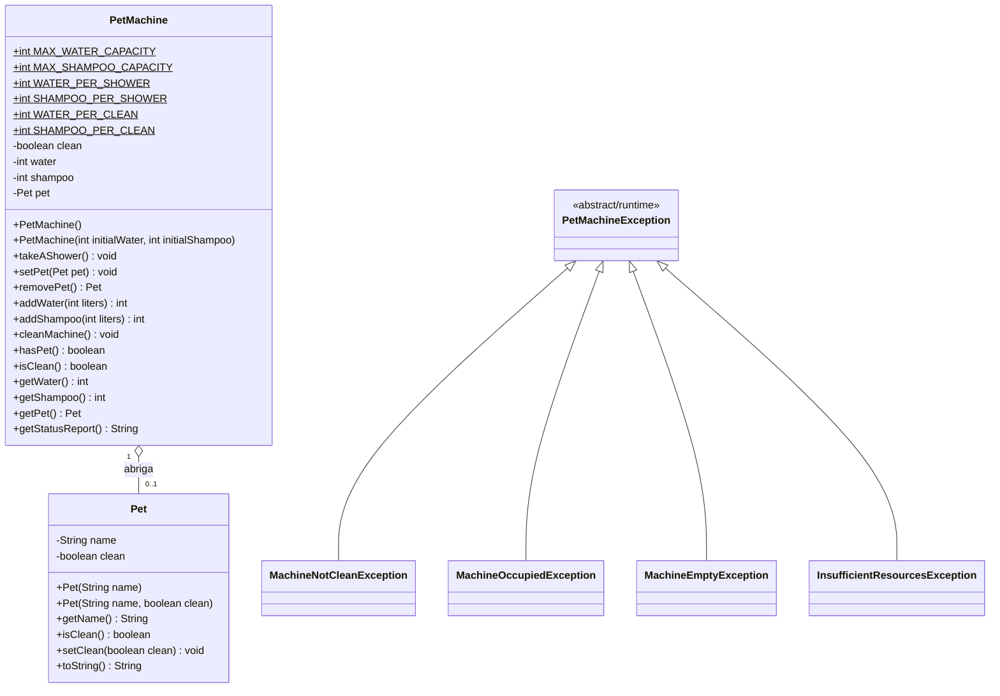

# 🐾 Pet Machine Simulator — Sistema Automatizado de Banho em Pets

[](https://www.oracle.com/java/)
[](https://maven.apache.org/)
[](https://junit.org/junit5/)
[](https://pt.wikipedia.org/wiki/Programa%C3%A7%C3%A3o_orientada_a_objetos)
[](LICENSE)

> **Projeto prático desenvolvido para consolidar os pilares da Programação Orientada a Objetos (POO), com ênfase em Encapsulamento Estrito, Modelagem de Domínio Rica, Tratamento de Exceções Especializadas e Testes Automatizados em Java 21.**

---

## 📌 Sumário
- [Visão Geral](#-visão-geral)
- [Diagrama de Classes (Mermaid)](#-diagrama-de-classes)
- [Pilares de Engenharia & POO Aplicados](#-pilares-de-engenharia--poo-aplicados)
- [Regras de Negócio Implementadas](#-regras-de-negócio-implementadas)
- [Estrutura do Projeto](#-estrutura-do-projeto)
- [Testes Automatizados (JUnit 5)](#-testes-automatizados-junit-5)
- [Como Executar o Projeto](#-como-executar-o-projeto)
- [Guia para Entrevistas Técnicas](#-guia-para-entrevistas-técnicas-java)
- [Autor](#-autor)

---

## 📖 Visão Geral

O **Pet Machine Simulator** modela o funcionamento de uma máquina inteligente de autoatendimento para banho em cães e animais domésticos. 

Mais do que um simples exercício de sintaxe, o projeto foi concebido para demonstrar **maturidade técnica de desenvolvimento backend**:
1. **Encapsulamento Defensivo:** Nenhuma variável de estado interno (`water`, `shampoo`, `clean`, `pet`) pode ser manipulada diretamente de fora da classe.
2. **Modelo Não-Anêmico (*Rich Domain Model*):** A classe `PetMachine` concentra comportamentos, validações de invariantes e transições de estado, em vez de ser apenas um repositório passivo de *getters* e *setters*.
3. **Exceções de Domínio Expressivas:** Substituição de flags de erro ou mensagens soltas no console por uma hierarquia semântica de `RuntimeException`.
4. **Qualidade Garantida por Testes:** Cobertura de 100% dos fluxos de negócio com 17 testes unitários automatizados em **JUnit 5**.

---

## 📊 Diagrama de Classes



---

## 🏛️ Pilares de Engenharia & POO Aplicados

### 1. Encapsulamento Estrito e Blindagem de Estado
- Todos os campos são estritamente `private`.
- As capacidades máximas de insumos (**30L de água** e **10L de shampoo**) são asseguradas matematicamente via `Math.min` e `Math.max`. É impossível atingir valores negativos ou transbordamentos através da API pública.
- Não existem *setters* indiscriminados. A alteração de estado ocorre exclusivamente por ações do mundo real: `takeAShower()`, `addWater()`, `cleanMachine()`.

### 2. Tratamento de Exceções de Domínio (Fail-Fast)
Ao invés de retornar valores mágicos (como `-1` ou `false`) ou poluir a lógica com `System.out.println()`, o domínio lança exceções especializadas:
- `MachineNotCleanException`: Impede a contaminação cruzada ao tentar colocar um pet em uma máquina suja.
- `MachineOccupiedException`: Impede a sobreposição física de animais na máquina.
- `MachineEmptyException`: Impede acionamento do banho a seco ou retirada de animal inexistente.
- `InsufficientResourcesException`: Garante que o ciclo de banho ou limpeza só inicie se houver insumos suficientes até o final.

### 3. Separação de Responsabilidades (SRP)
- **`Pet`**: Entidade que detém apenas os dados e integridade do animal.
- **`PetMachine`**: Núcleo de regras de negócio, controle de insumos e ciclo operacional.
- **`App`**: Camada de apresentação CLI (*Console UI*), responsável pela captura de comandos via `Scanner` e tratamento visual amigável das exceções.

---

## ⚙️ Regras de Negócio Implementadas

| Ação | Pré-requisitos | Consumo de Recursos | Efeito no Estado |
| :--- | :--- | :--- | :--- |
| **Colocar Pet (`setPet`)** | Máquina vazia (`pet == null`) E higienizada (`clean == true`) | Nenhum | Máquina passa a ter pet associado |
| **Dar Banho (`takeAShower`)** | Conter pet + Água $\ge 10\text{L}$ + Shampoo $\ge 2\text{L}$ | $-10\text{L}$ Água<br>$-2\text{L}$ Shampoo | Pet torna-se limpo (`clean = true`); Máquina torna-se suja (`clean = false`) |
| **Retirar Pet (`removePet`)** | Conter pet (`pet != null`) | Nenhum | Desassocia o animal e retorna a instância com seu estado |
| **Abastecer Água (`addWater`)** | Quantidade $> 0$ | $+N\text{L}$ (com teto em $30\text{L}$) | Aumenta nível de água sem transbordar |
| **Abastecer Shampoo (`addShampoo`)** | Quantidade $> 0$ | $+N\text{L}$ (com teto em $10\text{L}$) | Aumenta nível de shampoo sem transbordar |
| **Limpar Máquina (`cleanMachine`)** | Máquina sem pet + Água $\ge 3\text{L}$ + Shampoo $\ge 1\text{L}$ | $-3\text{L}$ Água<br>$-1\text{L}$ Shampoo | Máquina torna-se higienizada (`clean = true`) |

---

## 📂 Estrutura do Projeto

```text
pet-machine-simulator/
├── pom.xml                               # Configuração Maven e dependências (Java 21, JUnit 5)
├── README.md                             # Documentação técnica de arquitetura
├── .gitignore                            # Arquivos ignorados pelo Git
└── src/
    ├── main/
    │   └── java/
    │       └── com/dio/petmachine/
    │           ├── App.java              # Ponto de entrada e interface CLI interativa
    │           ├── model/
    │           │   └── Pet.java          # Entidade de domínio Pet
    │           ├── machine/
    │           │   └── PetMachine.java   # Regras de negócio e encapsulamento central
    │           └── exception/            # Hierarquia de exceções de domínio
    │               ├── PetMachineException.java
    │               ├── MachineNotCleanException.java
    │               ├── MachineOccupiedException.java
    │               ├── MachineEmptyException.java
    │               └── InsufficientResourcesException.java
    └── test/
        └── java/
            └── com/dio/petmachine/
                └── machine/
                    └── PetMachineTest.java # 17 Testes unitários com JUnit 5
```

---

## 🧪 Testes Automatizados (JUnit 5)

O projeto possui **17 testes unitários** organizados em classes aninhadas (`@Nested`) cobrindo cenários positivos e *edge cases*:

```text
[INFO] Running com.dio.petmachine.machine.PetMachineTest
[INFO] Tests run: 3, Failures: 0, Errors: 0 -- HigienizacaoTests
[INFO] Tests run: 4, Failures: 0, Errors: 0 -- ExecucaoBanhoTests
[INFO] Tests run: 6, Failures: 0, Errors: 0 -- EntradaSaidaPetTests
[INFO] Tests run: 4, Failures: 0, Errors: 0 -- AbastecimentoTests
[INFO] 
[INFO] Results:
[INFO] Tests run: 17, Failures: 0, Errors: 0, Skipped: 0
[INFO] BUILD SUCCESS
```

Para executar os testes:
```bash
mvn test
```

---

## 🚀 Como Executar o Projeto

### Pré-requisitos
- **Java JDK 21+** instalado e configurado no `PATH`
- **Apache Maven 3.9+** instalado (ou execute direto pelo `javac`)

### Execução via Maven
Clone o repositório e na raiz do projeto execute:
```bash
# Compilar e executar a aplicação interativa
mvn clean compile exec:java
```

### Execução Manual (Terminal Puro)
Se preferir rodar sem Maven:
```bash
# Compilação dos fontes
javac -d bin -sourcepath src/main/java src/main/java/com/dio/petmachine/App.java

# Execução
java -cp bin com.dio.petmachine.App
```

---

## 💼 Guia para Entrevistas Técnicas (Java)

Em entrevistas para vagas de **Desenvolvedor Java**, este projeto serve como base sólida para demonstrar conhecimentos práticos:

### 1. "O que é encapsulamento e como você o aplicou neste projeto?"
> *"Encapsulamento não é apenas colocar atributos privados e criar getters e setters. No projeto da Pet Machine, apliquei o encapsulamento comportamental: a classe protege suas invariantes de negócio. Por exemplo, a máquina não permite que o nível de água exceda 30 litros nem fique negativo, e não permite que um pet entre se a máquina estiver suja. O estado interno só muda através de métodos com propósito claro (`takeAShower`, `cleanMachine`), garantindo que o objeto nunca entre em estado inconsistente."*

### 2. "Por que você optou por Exceções de Domínio em vez de retornar boolean ou códigos de erro?"
> *"Utilizar exceções semânticas como `MachineNotCleanException` e `InsufficientResourcesException` adota o princípio Fail-Fast. Se uma operação não puder ser completada, o fluxo é interrompido imediatamente de forma explícita e autoexplicativa, evitando que o erro se propague silenciosamente. Além disso, desacopla a regra de negócio da interface de usuário, permitindo que a camada CLI capture a exceção e apresente a mensagem adequada."*

### 3. "Como você garantiu a confiabilidade do código?"
> *"Escrevi uma suíte de testes com JUnit 5 cobrindo 17 cenários, incluindo testes de limites (edge cases) como abastecimento excedente, tentativas de banho a seco, tentativas de higienização com pet no interior da câmara e bloqueio de contaminação cruzada."*

---

## 👨‍💻 Autor

Desenvolvido por **Rudson Lima**  
Foco em Engenharia de Software Backend com Java, Spring Boot e Inteligência Artificial.

[](https://www.linkedin.com/in/rudson-lima/)
[](https://github.com/rudsonlima)

---
*Projeto educacional baseado nas trilhas da Digital Innovation One (DIO) em parceria com Itaú & Santander.*
